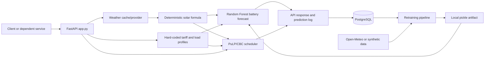

# Illuminate ML Service — Project Context for Humans and AI Agents

> Canonical orientation document for Codex, Claude, other coding agents, service
> owners, and reviewers. Read this before changing the repository or integrating
> another service with it.

## 1. Document status

- Audited on: **2026-08-30**
- Branch: `feature/train_and_admin`
- Commit: `d8f55ca8d7394d9b87e98dc189d2783485e337e2`
- Evidence base: tracked source, ignored local model artifacts, local data, and
  application logs. Environment variable **values were intentionally not read or
  copied**.
- Source code wins when this document and code disagree. Update this document in
  the same change whenever an API, formula, schema, environment variable, model,
  or operating procedure changes.

This document distinguishes:

- **Implemented** — behavior present in the current code.
- **Intended** — comments, names, or old product notes that are not fully enforced.
- **Open decision** — behavior that needs a product/domain owner to define.

## 2. What this project is

Illuminate ML Service is a prototype smart-home energy management backend. It
combines an HTTP API, weather enrichment, deterministic energy calculations, a
machine-learning battery forecast, and a mixed-integer scheduler.

It is more accurate to call it a **hybrid ML + operations-research service** than
only an ML service:

- FastAPI validates requests and orchestrates the workflow.
- PostgreSQL stores weather cache entries, prediction snapshots, model metadata,
  users, history, notifications, and administrator records.
- A `RandomForestRegressor` predicts 24 battery-level values.
- A PuLP/CBC mixed-integer linear program schedules devices and grid/battery
  flows over 24 one-hour slots.
- APScheduler starts weekly retraining inside the API process.
- Loguru writes local logs and can forward them to Better Stack or S3.

### The most important architectural fact

The ML battery forecast is currently **not used by the optimizer**. `/predict`
returns and logs the forecast, but `run_optimization()` independently computes a
battery trajectory from the initial charge, load, solar, and its own decision
variables. Do not claim that the Random Forest chooses or improves the schedule
unless this data flow is changed and verified.



## 3. Repository map and authority

| Path | Role | Current status |
|---|---|---|
| [`app.py`](app.py) | FastAPI app, schemas, routes, startup, weekly job, orchestration | Primary runtime authority |
| [`services/weather_service.py`](services/weather_service.py) | Live 24-hour weather, DB cache, stale/mock fallbacks | Active |
| [`services/solar_service.py`](services/solar_service.py) | Live solar-output calculation | Active |
| [`services/optimizer_service.py`](services/optimizer_service.py) | 24-hour PuLP/CBC scheduling model | Active |
| [`services/model_manager.py`](services/model_manager.py) | Model training, loading, inference, promotion, version cleanup | Active and authoritative |
| [`services/data_collection_service.py`](services/data_collection_service.py) | Open-Meteo/synthetic training-data generation | Active during retraining |
| [`services/auth_service.py`](services/auth_service.py) | Admin seeding, bcrypt, JWT issue/validation | Active |
| [`database.py`](database.py) | SQLAlchemy engine/session and connectivity check | Active |
| [`db_models.py`](db_models.py) | ORM schema | Current schema authority in code |
| [`middleware.py`](middleware.py) | Request IDs and request timing | Active |
| [`logger_setup.py`](logger_setup.py) | Console/file/Better Stack/S3 logging | Active |
| [`exceptions.py`](exceptions.py) | Application exception hierarchy | Partly used |
| [`backend/server.py`](backend/server.py) | `/app`-specific supervisor shim | Deployment adapter |
| [`train_model.py`](train_model.py) | Old CSV training entry point | **Stale and currently broken** |
| [`services/battery_service.py`](services/battery_service.py) | Older duplicate artifact loader | Unused by the app |
| [`Changelog.sql`](Changelog.sql) | Original hand-written schema | **Incomplete; not a migration source** |
| [`README.md`](README.md) | Minimal quickstart and links to canonical guides | Request/login examples aligned during this audit |
| `data/consumption_battery_data.csv` | Legacy synthetic/hourly data | Not used by production retraining |
| `models/*.pkl` | Local model artifacts | Ignored by Git; local-only state |
| `logs/*` | Local operational history | Ignored by Git; not an API contract |

There are currently no tracked tests, CI workflow, Dockerfile, packaging metadata,
Alembic configuration/migrations, or formal deployment runbook.

## 4. Runtime topology and startup

### Entry points

- From the repository root, the app object is `app:app`.
- A typical local command is:

  ```bash
  venv/bin/uvicorn app:app --host 0.0.0.0 --port 8000
  ```

- `backend/server.py` is only for an environment where this repository is mounted
  at `/app`. It inserts `/app` into `sys.path`, changes the working directory to
  `/app`, and re-exports `app` as `server:app`.
- Paths for `models/` and `logs/` are relative to the process working directory.
  Launching outside the repository root changes where state is read/written.

The inspected local virtual environment uses Python 3.13.5. That is an observation,
not a declared production runtime constraint.

### Startup sequence

The FastAPI lifespan performs the following:

1. Test PostgreSQL connectivity.
2. Call `Base.metadata.create_all(bind=engine)`.
3. Seed or refresh the configured admin account, if configured.
4. Load `models/battery_model.pkl`; if absent, train a model synchronously.
5. Start an in-process weekly retraining job for Sunday at 02:00.

A database or model-stage exception exits the process. `create_all()` creates
missing tables but does **not** alter existing tables, so it is not a substitute
for migrations.

There is also a soft-failure gap: if no artifact exists and training returns
`promoted: false` without raising, `ensure_model_loaded()` does not verify that an
in-memory model now exists. Startup can then log “ML model ready” while `/predict`
later returns model-not-loaded 503 and `/health` still reports only database state.

### Multi-worker warning

Every worker/process gets:

- its own SQLAlchemy pool;
- its own in-memory model bundle;
- its own scheduler and Sunday retraining job; and
- access to the same relative artifact filenames if storage is shared.

There is no leader election, distributed lock, atomic artifact swap, or model
reload broadcast. Treat the current design as single-process unless those concerns
are addressed.

## 5. Configuration contract

Never commit `.env`, copy secret values into issues/docs/prompts, or print them in
diagnostics. Only these variable names are safe to document:

| Variable | Purpose | Requirement |
|---|---|---|
| `DATABASE_URL` | Synchronous SQLAlchemy/PostgreSQL connection | Required at import/startup |
| `JWT_SECRET` | HS256 signing and verification | Required to issue/use admin JWTs |
| `ADMIN_EMAIL` | Idempotent startup admin seed | Optional, but admin login needs a seeded row |
| `ADMIN_PASSWORD` | Admin seed/refresh password | Optional; pair with `ADMIN_EMAIL` |
| `WEATHER_API_KEY` | Configured live weather provider key | Optional; mock data is used without it |
| `WEATHER_API_BASE_URL` | Live weather provider base URL | Optional; mock data is used without it |
| `BETTERSTACK_TOKEN` | Remote log streaming | Optional |
| `AWS_S3_BUCKET` | Crash/signal log upload destination | Optional |
| `AWS_REGION` | S3 region, default `ap-south-1` | Optional |
| `AWS_ACCESS_KEY_ID` | S3 credentials | Optional/configuration-dependent |
| `AWS_SECRET_ACCESS_KEY` | S3 credentials | Optional/configuration-dependent |

Most settings are read into module globals, so restart the service after changing
them. There is no `.env.example` or centralized startup validation yet.

## 6. External dependencies

| Dependency | Used for | Failure behavior |
|---|---|---|
| PostgreSQL | Required application state and cache | Startup fails; a request can also fail on a stale connection |
| Configured weather API | Live 24-hour weather by location string | Config/request/non-200 failures use stale/mock fallback; malformed success payloads can still fail |
| Open-Meteo Archive API | Historical weather for retraining | Fully synthetic historical weather fallback |
| Local writable filesystem | Model artifacts and local logs | Import, startup, retraining, or logging can fail |
| CBC via PuLP | MILP solve | Non-optimal status becomes HTTP 422 on `/predict` |
| Better Stack | Optional live logs | Disabled when token is absent |
| S3 | Optional signal/crash log upload | Failure is printed and otherwise ignored |

The exact live-weather provider is not declared by name in code. Its configured
endpoint is expected to accept `/{location}/next24hours` and return a
Visual-Crossing-like `days[*].hours[*]` response. Do not invent a production
provider contract beyond that observed shape.

## 7. HTTP API contract

There is no `/v1` prefix and no explicit response schema. FastAPI's default
`/docs` and `/openapi.json` are enabled.

### Endpoint inventory

| Method and path | Auth | Behavior |
|---|---|---|
| `GET /health` | Public | Checks DB with `SELECT 1`; always HTTP 200 with `ok` or `degraded` body |
| `POST /admin/login` | Public | Verifies bcrypt password; returns a 12-hour bearer JWT |
| `GET /admin/me` | Admin JWT | Returns current admin identity |
| `POST /predict` | Public | Weather, calculations, ML forecast, MILP schedule, best-effort persistence |
| `GET /notifications/{user_id}` | Public | Returns unread notifications for the supplied UUID |
| `GET /history/{user_id}` | Public | Returns up to 100 optimization records |
| `POST /retrain` | Admin JWT | Synchronously trains/evaluates and conditionally promotes |
| `GET /model/versions` | Public | Returns recorded model versions and metrics |
| `GET /prediction-logs` | Admin JWT | Returns up to 500 prediction-log summaries |

Public user-scoped history/notification endpoints are a current security gap, not
a recommendation. Standard validation/auth errors use FastAPI's `detail` shape;
custom `IlluminateError` responses use `error`, `message`, and `request_id`.

### Canonical `/predict` request

Older repository revisions and dependent clients may use top-level
`battery_capacity_kwh`, `solar_capacity_kw`, and `appliances`. That shape does not
match the code, and Pydantic may silently ignore those extra fields. The README was
corrected during this audit; the canonical nested schema is below:

```json
{
  "user_id": "optional-existing-user-uuid",
  "location": "Bangalore,IN",
  "latitude": 12.9716,
  "longitude": 77.5946,
  "current_battery_level_pct": 60,
  "settings": {
    "mode": "tou_savings",
    "battery_capacity_kwh": 15,
    "min_battery_reserve_pct": 20,
    "solar_capacity_kw": 5,
    "has_net_metering": true,
    "peak_start_hour": 17,
    "peak_end_hour": 21,
    "peak_tariff": 7.5,
    "offpeak_tariff": 3.5,
    "normal_tariff": 5.5
  },
  "devices": [
    {
      "name": "washing_machine",
      "power_rating_kw": 0.8,
      "usage_hours": 2,
      "priority": "normal",
      "earliest_hour": 9,
      "latest_hour": 18,
      "contiguous": true,
      "category": "washing_machine"
    }
  ]
}
```

Valid modes are `self_consumption`, `tou_savings`, `full_backup`, and
`low_power`. Device windows use an inclusive `earliest_hour` and exclusive
`latest_hour`; `latest_hour=24` is allowed.

### `/predict` response shape

The response contains:

- `status` — PuLP/CBC status, normally `Optimal`;
- `total_grid_cost` — the optimizer objective, not a verified savings number;
- `recommendations` — device name to human-readable schedule;
- `hourly_schedule` — 24 rows with grid buy/sell, optimizer battery level,
  solar output, and device flags;
- `weather` — temperature, humidity, and cloud cover from the first returned
  weather item;
- `tariffs` — 24 hard-coded tariff values;
- `battery_forecast` — 24 independent Random Forest predictions;
- `execution_time_ms` — measured before persistence finishes.

### Request processing sequence

1. Look up the newest weather cache row for `location` and accept it if younger
   than 30 minutes.
2. On a miss, fetch live weather. Missing configuration, request exceptions, and
   non-200 responses use stale cache or mock weather; JSON/schema errors and a
   failed successful-response cache commit are currently uncaught.
3. Calculate 24 solar values from cloud cover, normalized radiation, UV, and
   configured panel capacity.
4. Build fixed tariff and baseline-consumption arrays.
5. Predict 24 battery values with the current model.
6. Solve the 24-hour MILP using initial battery energy, not the forecast.
7. Best-effort insert a complete `PredictionLog`.
8. If `user_id` parses as a UUID, best-effort insert legacy history and
   notifications. The UUID must already exist in local `users` for the foreign key;
   this repository has no user-provisioning endpoint.
9. Return the combined result.

Persistence failures in steps 7–8 are logged and swallowed. A successful HTTP
response therefore does not guarantee that history or training data was saved.
There is no idempotency key; retries create additional prediction-log rows.
Any string can still be stored as `PredictionLog.user_id`; non-UUID strings simply
skip legacy history/notifications, while an unknown UUID makes those legacy writes
roll back silently.

### Settings accepted but not currently honored

These fields are validated/accepted but have no effect on the live schedule:

- `min_battery_reserve_pct`;
- `has_net_metering`;
- `peak_start_hour` and `peak_end_hour`;
- `peak_tariff`, `offpeak_tariff`, and `normal_tariff`;
- device `category`;
- request `latitude` and `longitude` during prediction.

Latitude/longitude are persisted in `PredictionLog` but are not written in the
normal request log and do not affect live weather, model inference, or optimization.
Manual retraining has a separate coordinate payload. Weekly retraining supplies no
coordinates and therefore uses the model manager's Delhi defaults. Live weather
uses `location`. Do not expose an input in a new client and assume it is effective
merely because the schema accepts it.

## 8. Persistence model

The ORM currently defines ten tables:

| Table | Purpose | Active writer/reader |
|---|---|---|
| `users` | Ordinary user identity | Relationships only; no user API here |
| `user_settings` | Saved household settings | No active API flow |
| `weather_cache` | Cached 24-hour weather JSON | Weather service |
| `tariff_history` | Intended tariff history | Unused |
| `optimization_results` | UUID-user optimization history | `/predict`, `/history` |
| `notifications` | UUID-user suggestions | `/predict`, `/notifications` |
| `actual_readings` | Intended real sensor ground truth | Read by retraining; save helper has no caller |
| `model_versions` | Training metrics and active artifact metadata | Model manager/API |
| `admin_users` | Admin credentials/role | Startup auth seed and admin auth |
| `prediction_logs` | Full request/derived/output snapshot | `/predict`, retraining, admin API |

Important schema facts:

- `Changelog.sql` creates only the original six tables and omits newer ORM tables
  and fields. It is not sufficient to reproduce the present schema.
- Alembic is installed but not configured.
- Foreign keys are nullable and have no explicit cascade policy.
- Common query columns lack purpose-built indexes.
- Timestamps are naive and mix Python UTC defaults with SQL `NOW()` in the old
  SQL file.
- Monetary values use floating-point columns.
- Weather cache and prediction logs grow without pruning or retention rules.
- `user_settings` says "one per user" in comments, but has no unique constraint.

## 9. Model lifecycle and data lineage

Production inference uses `services/model_manager.py`, not `train_model.py`.

### Artifact lifecycle

- Current alias: `models/battery_model.pkl`.
- Versioned name: `models/battery_model_v{N}_{timestamp}.pkl`.
- Bundle content: a scikit-learn model and `MinMaxScaler` serialized with pickle.
- In-memory state: process-local module global `_model_data`.
- Retention: code deletes artifact files beyond the newest three database rows,
  but does not delete those old database rows.

Pickle is executable serialization. Load only trusted artifacts and eventually add
checksum/signature validation or use a safer controlled artifact format/registry.

### Retraining sources

`train_model()` combines:

1. Open-Meteo historical weather enriched with deterministic synthetic tariffs,
   load, solar, and battery labels — one copy;
2. `actual_readings` — three identical copies as ad hoc weighting;
3. all `prediction_logs` exploded into hourly rows — two identical copies.

It drops nulls, fits a MinMax scaler, randomly splits 80/20, trains 100 Random
Forest trees, computes RMSE/R², and promotes only if R² is at least 0.01 above the
currently active database record. The first recorded model is always eligible.

The `used_for_training` flag is bulk-marked after promotion but is not used to
filter future training. The same bulk update stamps every previously unmarked log,
including logs skipped while constructing the DataFrame. Consequently,
`PredictionLog.model_version` neither identifies the generating model nor reliably
proves that a specific row trained the stamped version.

### Data-quality warning

Prediction-log labels are the old model's own `battery_forecast`, not measured
battery values. Retraining also adds scheduled device load to the feature even
though that stored forecast was generated before device scheduling. This is
pseudo-label feedback with inconsistent feature/target pairs—not real online
learning.

See [`ML_SYSTEM_AND_INTERVIEW_GUIDE.md`](ML_SYSTEM_AND_INTERVIEW_GUIDE.md) for all
formulas, metrics, artifact evidence, leakage analysis, and redesign options.

## 10. Implemented optimizer behavior versus mode names

| Mode | What code actually changes | Important mismatch |
|---|---|---|
| `tou_savings` | Devices active; battery discharge up to 3 kW | Baseline behavior |
| `self_consumption` | Same effective model as `tou_savings` | Configured grid penalty is never used |
| `full_backup` | Sets battery-discharge upper bound to zero | Does not fill or keep battery full |
| `low_power` | Omits every supplied device from the model | Does not selectively reduce heavy loads |

Other important facts:

- Priority adds a fixed penalty per scheduled hour, but scheduled hours are fixed;
  it therefore does not influence placement.
- The returned `total_grid_cost` includes that dimensionless priority term and
  export credits, so it is not a pure import bill.
- `estimated_savings` in legacy history is `abs(total_grid_cost)`, not a comparison
  with an unoptimized baseline.
- The current contiguity formulation can permit two separated blocks when a device
  starts at hour 0.
- Duplicate device names collide in response dictionaries.
- There is no minimum reserve, terminal state-of-charge target, efficiency/loss,
  self-discharge, battery degradation cost, or charge/discharge mutual exclusion.

## 11. Reliability, security, and correctness backlog

### P0 — address before calling the service production-ready

1. Rotate/revoke the previously documented concrete-looking login credentials if
   they were ever valid; the README now uses placeholders.
2. Authenticate ordinary users and enforce ownership on history/notifications;
   rate-limit login and public prediction.
3. Add Alembic migrations and reconcile the deployed database with the ORM.
4. Make the request contract strict (`extra="forbid"`) and validate device counts,
   windows, capacities, locations, limits, and retraining ranges.
5. Correct the energy model and make accepted reserve, tariff, and net-metering
   settings effective—or remove them from the public contract.
6. Define measured ground-truth ingestion; stop training on old predictions as if
   they were observations.
7. Establish one trusted, atomic, versioned artifact store and a single retraining
   owner/lock for multi-worker deployments.

### P1 — required for dependable operation

1. Add unit, API, optimizer-property, schema-migration, and time-split ML tests,
   then add CI.
2. Add `pool_pre_ping`, connection recycling/timeouts, and meaningful readiness
   checks for DB, model, artifact storage, and solver.
3. Return weather provenance (`live`, `cache`, `stale`, `synthetic`) and align
   weather hours with tariff/load hours and timezone.
4. Add typed response models, a versioned route prefix, client timeouts,
   idempotency semantics, configurable CORS, and input/rate limits.
5. Add model generation provenance at inference, fixed evaluation datasets,
   audit trails, rollback, drift monitoring, and atomic promotion.
6. Define retention, deletion, consent, encryption, and PII handling for logs and
   prediction snapshots.

### P2 — maintainability and scale

1. Move scheduled retraining into a single worker/job system.
2. Replace relative paths and hard-coded `/app` assumptions with explicit config.
3. Prune/partition cache and log tables and add indexes.
4. Separate direct runtime dependencies from development/transitive pins.
5. Remove or repair obsolete `train_model.py`, `battery_service.py`, and
   `Changelog.sql` after a migration path exists.

## 12. Working rules for AI coding agents

### Before changing code

1. Read this document and the ML/interview guide.
2. Run `git status --short` and preserve unrelated user changes.
3. Trace every input through `app.py` into the called service. Schema presence does
   not prove that a setting is implemented.
4. Search for duplicate implementations before editing. Model loading and training
   have legacy files.
5. Never display `.env`, local credentials, JWTs, database URLs, log contents with
   personal data, or unredacted prediction snapshots.

### Coupled files that should change together

| If changing... | Also review/update... |
|---|---|
| `/predict` request or response | Pydantic schemas, optimizer/model call, persistence JSON, README, this document, downstream contract tests |
| Tariff/load/solar logic | Live services, training-data generator, unit conventions, model evaluation, interview guide |
| Model features/target | `FEATURE_COLS`, data loaders, artifact version, inference, metrics, schema/provenance, tests |
| Optimizer variables/constraints | All four modes, objective label, schedule response, infeasibility validation, worked examples/tests |
| ORM schema | Alembic migration, indexes/constraints, SQL docs, retention and rollback behavior |
| Authentication | OpenAPI security scheme, ownership checks, login/JWT tests, secrets/runbook |
| Retraining/promotion | scheduler, admin endpoint, locks, artifact store, DB transaction, multi-worker reload, rollback |
| Environment variables | `.env.example` (when added), startup validation, deployment docs, secret manager |

### Minimum verification expected for future changes

- Parse/import or compile all Python sources without writing secrets.
- Run focused unit tests for formulas and validation.
- Test optimizer feasibility plus energy-balance and state-of-charge invariants.
- Test all modes; names currently do not imply correct behavior.
- Test the canonical request against the OpenAPI schema and an isolated database.
- For ML changes, use grouped chronological evaluation and compare with a simple
  baseline on a fixed holdout set.
- Confirm failure paths: weather unavailable, stale DB connection, missing model,
  infeasible device window, persistence rollback, and invalid/expired JWT.
- Re-read generated diffs for credential or local-artifact leakage.

Do not make production network calls, retrain against a production database,
rotate credentials, delete artifacts, or apply schema changes without explicit
authorization and a rollback plan.

## 13. Integration guidance for dependent services

- Treat `/predict` as a side-effecting operation because it attempts to persist a
  snapshot even though it uses `POST` only for computation.
- Send structured `devices`, not an appliance-name list.
- Send an existing local `users.id` UUID when history/notifications are required.
  Other strings are retained only in `prediction_logs`; unknown UUIDs make legacy
  history/notification writes roll back without failing `/predict`.
- Use unique device names until response keys use stable IDs.
- Validate `earliest_hour < latest_hour` and `usage_hours <= window length` client
  side; the current API can otherwise return 422 from the solver.
- Do not display `total_grid_cost` as savings. Calculate a comparable baseline
  under the same load, tariff, battery, and export rules.
- Treat `battery_forecast` as experimental/advisory, not a physical guarantee.
- Expect fallbacks to look like successful weather unless provenance is added.
- Capture `X-Request-ID` for support, but do not assume requests are idempotent.
- Use timeouts longer than the weather request plus MILP solve, and define retry
  policy carefully because retries write more logs.
- Do not rely on public user-history access; it must be secured.
- Admin callers send `Authorization: Bearer <access_token>`. Tokens expire after
  12 hours and there is no refresh/revocation flow.
- Pin integrations to an agreed schema because there is no API version namespace.

## 14. Open decisions for the owner

Do not let an AI silently decide these domain/product questions:

1. Is battery capacity 15 kWh, 30 kWh, or household-specific? Why is default solar
   capacity 100 kW in code while a household example is closer to 5 kW?
2. What source is authoritative for tariffs by location, taxes, export rate, and
   net-metering rules?
3. What precisely distinguishes the four modes in mathematical constraints and
   objective weights?
4. Must the battery finish the day at a reserve/initial level? What are charge and
   discharge efficiencies, limits, and degradation costs?
5. Should ML forecast load/solar/SOC, and should its output constrain the MILP?
6. Which system supplies measured battery, solar, grid, and device readings, with
   what timestamp/timezone and quality guarantees?
7. Is the model global, regional, household-specific, or hardware-specific?
8. Which service owns users and authenticates ordinary user requests?
9. Are synthetic/stale weather and best-effort persistence acceptable as silent
   success, or must the response indicate degradation?
10. What are latency, availability, prediction-quality, solver-feasibility, and
    cost-savings SLOs?
11. What are data retention, consent, deletion, encryption, and audit requirements?
12. Will production use multiple processes/replicas, and what platform owns jobs,
    models, secrets, and persistent storage?
13. Is backward compatibility with the pre-audit top-level request shape required?
14. Should `PredictionLog.model_version` identify the generating model, the future
    training consumer, or both as separate fields?

## 15. Safe next step

Before feature work, establish a tested baseline: correct the public contract,
add migrations and core tests, define the physical energy equations and measured
ground truth, then retrain/evaluate on a fixed chronological holdout. This makes
later ML and optimization improvements measurable instead of cosmetic.
