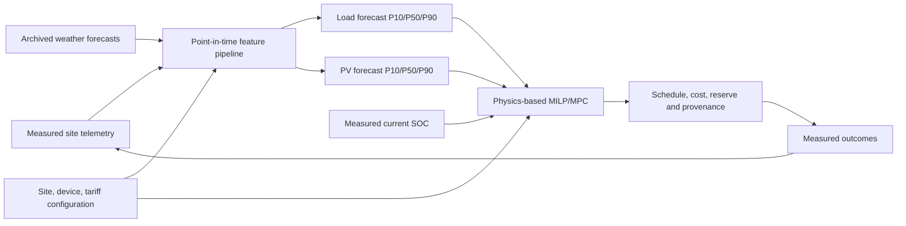

# Illuminate ML Improvement Plan

> Implementation roadmap for replacing the current advisory battery-level model
> with measurable load/PV forecasting, physically correct battery dynamics, and a
> forecast-consuming optimizer.

## 1. Document status and scope

- Prepared on: **2026-08-30**
- Repository branch at planning time: `feature/train_and_admin`
- Baseline commit: `d8f55ca8d7394d9b87e98dc189d2783485e337e2`
- Related context: [`PROJECT_CONTEXT.md`](PROJECT_CONTEXT.md)
- Theory and interview guide:
  [`ML_SYSTEM_AND_INTERVIEW_GUIDE.md`](ML_SYSTEM_AND_INTERVIEW_GUIDE.md)

This is a delivery plan, not a guarantee of model accuracy or business savings.
Expected results must be confirmed on measured data and a locked validation set.

### Effort assumptions

The estimates assume:

- one backend/ML engineer working mainly on this service;
- part-time access to a domain owner, DevOps engineer, and downstream client owner;
- PostgreSQL remains the primary metadata/operational database;
- the existing `/predict` contract must remain backward compatible during rollout;
- hardware, consent, and telemetry integrations are not already production-ready;
- engineer effort excludes calendar waiting time needed to accumulate data;
- no production schema, credential, or model change is applied without approval.

Effort ranges are planning estimates. Hardware procurement, utility access,
security review, and multi-repository integrations can increase them materially.

## 2. Executive decision

### Do not improve the current model by tuning it

The current Random Forest tries to infer battery energy from only current load,
tariff, and solar. Battery state depends on initial state and all prior charge and
discharge actions. Hyperparameter tuning cannot recover information that is absent
from the features.

The current nominal model evidence is also weak:

- promoted model: RMSE `0.7728 kWh`, R² `0.0209`;
- labels contain simulated battery values and previous model predictions;
- duplicated rows can cross the random train/test split;
- the scaler is fitted before splitting;
- the optimizer does not consume the ML battery forecast.

### Recommended responsibility split

- Use ML to forecast **future uncontrollable household load**.
- Use ML or a physics-plus-residual model to forecast **available PV generation**.
- Calculate battery SOC with a tested physical state equation.
- Supply load/PV forecasts and uncertainty to a corrected MILP/MPC optimizer.
- Treat tariff, hardware limits, and user constraints as versioned deterministic
  inputs—not learning targets.



## 3. Desired final result

At completion, the service should:

1. ingest validated, consented, timestamp-aligned actual readings;
2. forecast hourly load and available PV for the next 24 hours;
3. return forecast uncertainty and source/model provenance;
4. propagate measured SOC through physical battery equations;
5. enforce capacity, reserve, efficiency, power, terminal SOC, tariff, export, and
   user/device constraints;
6. calculate savings against an explicit comparable baseline;
7. evaluate models chronologically against naive and physics baselines;
8. promote artifacts atomically from a single controlled training process;
9. shadow and canary new behavior without breaking existing clients;
10. monitor forecast quality, physical violations, realized cost, feasibility,
    latency, fallbacks, and drift.

## 4. Roadmap summary

| Phase | Method | Primary source/input | Engineer effort | Expected result |
|---|---|---|---:|---|
| 0. Freeze and measure legacy | Contract tests, golden replay, CI | Current API/code/artifact | 3–5 days | Reproducible baseline and safe change boundary |
| 1. Data and lineage foundation | Migrations, telemetry schema, idempotent ingestion, quality reports | Smart meter, inverter, BMS, devices, official tariffs | 2–4 weeks engineering; 8–12+ weeks collection | Trustworthy actual labels and point-in-time lineage |
| 2. Offline forecasting | Naive baselines, Ridge/RF/gradient boosting, rolling backtests | Actual load/PV plus archived forecasts | 2–3 weeks after usable data | Reproducible load/PV candidate models |
| 3. Shadow serving | Serve forecasts without changing schedules | Candidate artifacts plus live inputs | 1–2 weeks engineering; 2–4 weeks observation | Online/offline consistency and operational evidence |
| 4. Optimizer v2 | Physical equality, SOC dynamics, uncertainty scenarios | Load/PV forecasts, measured SOC, real tariffs/config | 2–4 weeks | Safe forecast-driven schedules and true baseline savings |
| 5. Model lifecycle | External job, registry, checksum, atomic promotion, rollback | Locked datasets and artifacts | 2–3 weeks | Multi-worker-safe reproducible model operations |
| 6. Canary and migration | Feature flag/version, site canary, replay and outcome comparison | Shadow/canary actual outcomes | 1–2 weeks engineering; 2–4+ weeks observation | Evidence-based v2 promotion or rollback |

Minimum engineering total is approximately **10–17 engineer-weeks**, excluding
data-collection waiting time, hardware deployment, cross-repository client work,
and formal security/compliance review.

## 5. Phase 0 — Freeze and measure the legacy system

### Objective

Create a reliable reference before changing model or optimizer behavior.

### Method

1. Capture the current OpenAPI document and canonical `/predict` examples.
2. Add deterministic unit tests for tariff boundaries, load boundaries, mock
   weather, live solar formula, model input order, and every optimizer mode.
3. Build a small immutable replay fixture containing request, weather, artifact
   version, expected response keys, status, and tolerances.
4. Add tests that explicitly demonstrate known legacy behavior:

   - initial battery percentage does not affect the RF forecast;
   - the forecast does not affect optimization;
   - `self_consumption` and `tou_savings` are equivalent;
   - priority does not move device hours;
   - `full_backup` only disables discharge;
   - contiguity can fail when a block starts at hour zero.

5. Add CI that runs syntax, tests, dependency checks, and secret scanning.
6. Add an additive `algorithm_version`, defaulting to `legacy-v1`, or introduce it
   internally first if public schema coordination is not ready.

### Repository work

- Add `tests/test_api_contract.py`.
- Add `tests/test_tariff_and_load.py`.
- Add `tests/test_solar.py`.
- Add `tests/test_model_contract.py`.
- Add `tests/test_optimizer_legacy.py`.
- Add `tests/fixtures/legacy_replay.json` with no credentials or personal data.
- Add a CI workflow after the project's deployment platform is confirmed.

### Effort

- 3–5 engineer-days.
- Add 1–2 days if PostgreSQL integration tests require new container/platform work.

### Acceptance result

- Current requests retain response keys/status codes.
- Tests reproduce intended and known-broken legacy behavior.
- A later improvement can demonstrate exactly what changed.

## 6. Phase 1 — Measured data and lineage foundation

### Objective

Replace manufactured SOC targets and model-generated pseudo-labels with actual,
timestamped outcomes.

### Canonical raw-event envelope

Every imported record should contain:

```text
event_id
schema_version
source_system
source_record_id
site_id                  # pseudonymous
asset_id
interval_start_utc
interval_end_utc
timezone                 # IANA name, e.g. Asia/Kolkata
observed_at_utc
available_at_utc
ingested_at_utc
correction_version
quality_flags
payload_sha256
consent_policy_version
```

`available_at_utc` is essential. A historical feature is valid only if it was
available by the original decision time.

### Required production telemetry

| Domain | Required values | Authoritative source | Training/optimization use |
|---|---|---|---|
| Site configuration | Coordinates, timezone, meter topology, PV capacity/tilt/azimuth, inverter limit | Installer/onboarding plus verified hardware inventory | Site features and physical limits |
| Household load | Interval energy, average/peak power | Behind-the-meter whole-home CT/submeter | Load forecast target |
| Grid | Import/export energy, outage duration, optional voltage/frequency | Revenue smart meter/HAN or calibrated bidirectional meter | Reconciliation and realized cost |
| PV | AC generation energy/power, inverter state, clipping/curtailment | Solar inverter/gateway | PV forecast target |
| Battery | SOC, energy, charge/discharge energy/power, temperature, state of health | BMS/hybrid inverter | Initial state, physics validation, residual analysis |
| Control actions | Requested, acknowledged and realized battery/device actions, timestamps and failures | Illuminate control plane plus device acknowledgement | Outcome attribution and policy evaluation |
| Device configuration | Stable ID, category/model, rated limits, flexibility, required energy/runtime, windows, minimum on/off duration | User settings plus verified device catalog | Optimizer constraints and planned load |
| Device outcomes | Actual on-fraction, energy, start/stop, user override | Smart plug/device integration | Execution truth, not recommendation text |
| Weather forecast | Issue/model-run time, valid time, lead, provider/model, temperature, cloud, GHI/DNI/DHI, raw hash | Archived online-provider response | Point-in-time load/PV features |
| Weather actual | Valid interval, source/version, solar/weather fields | Rooftop sensor, station, or reanalysis | Labels, diagnostics, oracle benchmark |
| Tariff | Plan/version, effective period, import/export price, slabs, taxes, fixed/demand charges, net-metering rule | Customer plan plus regulator/DISCOM order | Deterministic optimizer input and realized bill |
| Decision lineage | Prediction ID, request ID, generating model/artifact hash, feature/data cutoff, weather run, tariff, optimizer/code version | Illuminate | Reproduction and audit |

Do not treat net grid import as total household load when PV or a battery is behind
the meter. Meter topology and sign conventions must be defined first.

### Recommended interval policy

- Preserve raw 1–5-minute readings when hardware permits.
- Create immutable 15-minute and hourly aggregates.
- Keep the first optimizer-v2 release hourly for compatibility.
- Express interval energy as kWh; if average power is stored, also store interval
  duration and never mix kW with kWh.
- Store timestamps in UTC and retain the IANA timezone for local features.
- Never derive hour from DataFrame row position.

### Schema and ingestion work

Add Alembic before changing tables. Suggested tables:

- `sites` and versioned `site_assets`;
- `energy_readings` for aligned measured flows/state;
- `device_readings` and `control_actions`;
- `weather_forecast_runs` and `weather_actuals`;
- `tariff_plans` and interval/rule versions;
- `forecast_runs` and per-horizon predictions;
- extended `model_versions` and `dataset_versions`.

Separate these two concepts:

- `generating_model_version` — produced a prediction;
- `training_consumed_by_version` — later used a validated label, if applicable.

Add either a protected idempotent telemetry endpoint or a documented batch-import
job. Use source-system keys and payload hashes to prevent duplicate effects.

### Data-quality checks

1. Quarantine duplicate intervals, overlaps, clock reversals, counter resets, and
   contradictory corrections.
2. Validate SOC in `[0,100]`, non-negative normalized flows, hardware limits,
   tariff coverage, and `forecast_issue_time <= decision_time`.
3. Reconcile every interval within meter-accuracy tolerance:

   ```text
   grid_import + PV + battery_discharge
     ~= household_load + battery_charge + grid_export + curtailment + losses
   ```

4. Validate measured SOC movement against charge/discharge, capacity, and elapsed
   time.
5. Flag stuck sensors, gaps, night PV, impossible device energy, stale forecasts,
   firmware/config changes, and synthetic/imputed values.
6. Preserve raw records and correction history; never overwrite silently.
7. Keep identity/address data outside the analytics dataset, encrypt sensitive
   data, and implement consent, retention, access, and deletion controls.

### Effort and collection gate

- Schema, migrations, ingestion and quality reporting: 2–4 engineer-weeks.
- Initial non-seasonal pilot: at least 90 consecutive days/site with at least 95%
  valid intervals.
- Recommended pilot population: roughly 20–50 diverse instrumented homes.
- Year-round claims: prefer 12 months/site or a justified diverse multi-site sample.
- At 15-minute resolution, one complete site-year has 35,040 intervals.

### Acceptance result

- Actual load and PV labels are timestamp-aligned and reproducible.
- Battery readings/actions reconcile within documented hardware tolerances.
- Every training feature has point-in-time availability and source provenance.
- Prediction logs remain audit context and are no longer used as ground truth.

## 7. Data sources and acquisition plan

### 7.1 Source priority

Use sources in this order:

1. synchronized measured telemetry from the target homes;
2. archived forecasts and official versioned tariff/configuration documents;
3. public measured datasets for pipeline development and baselines;
4. synthetic data only for unit/property/load tests, always tagged synthetic.

Public data cannot certify production performance because it usually lacks the joint
distribution of Indian household load, PV, BMS SOC, tariffs, and executed controls.

### 7.2 Weather and solar sources

- Use the [Open-Meteo Historical Forecast API](https://open-meteo.com/en/docs/historical-forecast-api)
  or archived provider runs to obtain weather forecasts as they would have appeared
  at a historical decision time. Previous/single runs are preferred when exact lead
  time matters.
- Use the [NASA POWER Hourly API](https://power.larc.nasa.gov/docs/services/api/temporal/hourly/)
  for globally available hourly solar and meteorological baselines. Treat it as
  historical/reference data, not automatically as the exact forecast seen online.
- Prefer inverter AC generation as the PV label. Weather-derived PV is an input or
  baseline, not measured generation.
- Archive provider/model/run, issue time, valid time, lead time, coordinates,
  units, request parameters, and a raw response hash.

### 7.3 Tariff sources

- Use the applicable regulator and customer utility plan, with effective dates.
- Delhi deployments should consume official
  [DERC tariff orders](https://derc.gov.in/tarriff-orders).
- Bengaluru deployments should consume the applicable KERC/BESCOM tariff and
  rooftop/net-metering orders; the
  [BESCOM rooftop portal](https://srtpv.bescom.org/SRTPV/) links regulations and
  tariff orders.
- Store the source document URI/hash and a normalized executable rule version.
- Do not train a model to imitate known tariff rules.

### 7.4 Public bootstrap datasets

| Dataset | What it provides | Appropriate use | Important limitation |
|---|---|---|---|
| [I-BLEND](https://www.nature.com/articles/sdata201915) | 52 months of one-minute electrical data from seven Indian campus commercial/residential buildings | Indian-context ingestion, aggregation, load baselines | Campus buildings are not representative of all homes; no joint BMS/control truth |
| [BEE NEEM](https://beeindia.gov.in/WriteReadData/L45218/1735192320.pdf) | Indian residential end-use study with real-time monitoring for 200 households | India-specific pattern/domain analysis when export/access terms permit | Dashboard/export granularity and continued availability must be verified |
| [UCI Household Power Consumption](https://archive.ics.uci.edu/dataset/235/individual%2Bhousehold%2Belectric%2Bpower%2Bconsumption) | Almost four years of one-minute measurements from one French household | Missing-data, lag-feature, and household-load pipeline tests | One non-Indian household; no PV/BMS/control joint data |
| [UCI ElectricityLoadDiagrams](https://archive.ics.uci.edu/dataset/321/electricityloaddiagrams2011) | 15-minute consumption for 370 Portuguese clients | Multi-client load forecasting and held-out-client evaluation | Different geography, customers and tariff behavior |
| [REFIT](https://pureportal.strath.ac.uk/en/datasets/31da3ece-f902-4e95-a093-e0a9536983c4) | Aggregate and appliance power for 20 UK homes at eight-second resolution | Device/load aggregation and appliance feature prototypes | UK domain; no synchronized Indian tariff/PV/BMS state |
| [Ausgrid Solar Home Electricity Data](https://data.gov.au/data/en/dataset/nsw-solar-home-electricty-data) | Half-hour data for 300 Australian rooftop-solar homes | Joint load/PV pipeline and baseline tests | Australian climate/tariffs; no synchronized battery/control labels |

Verify the dataset license and citation requirements before downloading or
redistributing it. Keep public, synthetic, pilot, and production origins separate in
storage and metric reports.

### 7.5 Acquisition result

Public datasets should allow development of:

- adapters and unit conversions;
- resampling/missing-data logic;
- point-in-time feature generation;
- naive/Ridge/tree baselines;
- rolling and held-out-site evaluation;
- data-quality and optimizer-replay infrastructure.

Only target-site measured data should support production quality or savings claims.

## 8. Phase 2 — Offline load and PV forecasting

### Objective

Produce reliable next-24-hour forecasts for uncertain exogenous inputs, with
uncertainty, while battery SOC remains governed by physics.

### 8.1 Training-row definition

For each historical decision time `t` and forecast horizon `h` from 1 through 24:

```text
load_target(t, h) = measured uncontrollable household load at t + h
pv_target(t, h)   = measured available PV generation at t + h
```

Feature values must be those available at time `t`. Include `forecast_horizon` as a
feature or train separate direct models per horizon.

Explicitly exclude optimizer-controlled device energy from the baseline-load target
when it can be measured separately. Add planned controllable device energy in the
optimizer so it is not double-counted.

### 8.2 Load forecast features

- load lags at 1, 2, 3, 24, 48 and 168 hours;
- rolling mean, median, standard deviation, min/max over 3, 6, 24 and 168 hours;
- hour/day encoded with sine and cosine;
- weekday, weekend, holiday and season;
- occupancy only if consented, reliable, and actually available online;
- forecast temperature, humidity and possibly apparent temperature;
- site or model-group identifier, or a deliberately per-site model;
- known planned device load;
- missingness, stale-input, fallback, outage, and firmware/config indicators.

### 8.3 PV forecast features

- forecast GHI, DNI, DHI, cloud cover and temperature;
- solar elevation/azimuth and day-of-year;
- panel capacity, tilt, azimuth, inverter limit and loss assumptions;
- lagged measured PV and recent forecast error;
- curtailment/clipping/inverter-state flags;
- provider/model/run/lead and quality/fallback indicators.

### 8.4 Model sequence

Train and evaluate in this order:

1. **Load naive baselines:** previous interval, same hour yesterday, same hour last
   week, rolling/hour-of-week mean or median.
2. **PV baseline:** zero at night plus a clear-sky/weather/installation formula.
3. **Ridge regression:** interpretable feature and leakage sanity check.
4. **Legacy Random Forest comparator:** corrected targets/features/splits only.
5. **`HistGradientBoostingRegressor`:** primary scikit-learn tabular candidate.
6. **Quantile boosting:** P10/P50/P90 load and PV for conservative scenarios.
7. Consider LightGBM/CatBoost/XGBoost only after dependency/security/operational
   review and evidence that scikit-learn candidates are insufficient.
8. Consider LSTM/TFT/Transformer models only with clean seasonal multi-site data and
   a demonstrated fixed-backtest plus downstream-cost improvement.

### Why not start with deep learning?

The present repository has 2,624 flawed legacy CSV rows and no reliable production
labels. Complex sequence models increase tuning, serving, explainability, and drift
costs without repairing data lineage or physical specification.

### 8.5 Suggested code structure

- Add `services/feature_pipeline.py` for point-in-time-safe feature creation.
- Add `services/forecast_service.py` returning a typed `ForecastBundle`.
- Add `training/build_dataset.py` for immutable dataset manifests.
- Add `training/train_load.py` and `training/train_pv.py`.
- Add `training/backtest.py` for shared rolling evaluation.
- Add `training/baselines.py` for naive/physics baselines.
- Refactor `services/model_manager.py` into model registry/loading concerns and keep
  a legacy compatibility adapter while `battery_forecast` is deprecated.
- Replace manufactured SOC labels in `services/data_collection_service.py` with
  measured load/PV joins or retire that responsibility.

### Effort

- Feature/dataset/backtest framework: 1–2 engineer-weeks.
- Baselines and first tree candidates: 1 engineer-week.
- Quantiles, tuning and slice analysis: 3–5 additional days.
- This work begins only after a data-quality gate provides usable labels.

### Acceptance result

- Dataset construction is reproducible from a versioned manifest.
- Every feature passes a no-future-information test.
- Load/PV candidates beat the strongest naive baseline on a locked holdout.
- Metrics are reported by horizon, site, season, regime, and provenance.
- Artifacts contain feature schema, code/data version, metrics, and checksum.

## 9. Leakage-safe validation method

### 9.1 Seen-site future performance

For each eligible site:

- lock the latest eight continuous weeks, or latest 20% if history is shorter, as
  a final untouched test set;
- use earlier expanding-window folds for tuning;
- split by complete days;
- purge samples whose 24-hour target window crosses a fold boundary;
- embargo at least the maximum forecast horizon around boundaries.

Example:

```text
Fold 1: train Jan–Jun       validate first two weeks of July
Fold 2: train Jan–Jul       validate first two weeks of August
Fold 3: train Jan–Aug       validate first two weeks of September
Final:  latest eight weeks  untouched test
```

### 9.2 Unseen-site generalization

If the product claims that one model works for a new home:

- reserve about 20% of complete sites as a group-held-out final test;
- allow no row or site-derived statistic from those sites into training/tuning;
- report this result separately from future performance on known sites.

If this result is poor, use site-specific models, calibrated global models, or an
explicit cold-start procedure instead of hiding the limitation.

### 9.3 Leakage controls

1. Deduplicate before splitting using source keys and content hashes.
2. Keep the same site/day, request, battery episode, and overlapping target horizon
   entirely in one fold.
3. Fit imputers, scalers, encoders, site statistics, feature selection, and tuning
   only inside training folds.
4. Replace row duplication with explicit training-only `sample_weight`.
5. Join the latest weather forecast issued at or before the historical decision.
6. Treat realized/reanalysis weather as an oracle benchmark, not a live feature.
7. Apply tariff, hardware and device configuration versions effective at decision
   time.
8. Never use future corrections or eventual outcomes as historical features.
9. Keep public/synthetic rows outside the production holdout and report domains
   separately.
10. Freeze site/time ranges, filters, source/license versions, code revision, hashes,
    row counts and quality summary in the evaluation manifest.
11. Evaluate champion and challenger on the exact same locked manifest.

### 9.4 Validation result

- Offline scores estimate actual future behavior rather than memorized adjacent
  rows.
- Metrics can distinguish known-site forecasting from new-site generalization.
- Model promotion becomes comparable, reproducible, and reviewable.

## 10. Metrics, R², and acceptance gates

### 10.1 What R² means

For actual target `y`, prediction `y_hat`, and target mean `y_mean`:

```text
R2 = 1 - sum((y - y_hat)^2) / sum((y - y_mean)^2)
```

- `1.0` is perfect on that evaluation set.
- `0.0` is no better in squared error than predicting the evaluation-set mean.
- a negative value is worse than that constant-mean baseline.
- R² is not “percentage accuracy.”

The current logged R² `0.0209` means the nominal model explains only about 2.1% of
the nominal test-label variance. It is also not trustworthy production evidence
because of pseudo-labels, row duplication, temporal leakage, and preprocessing
before splitting.

Do not require an arbitrary R² such as `0.8`. Time-series leakage can produce a high
R² while online decisions remain poor. R² should be secondary to baseline skill,
error slices, uncertainty calibration, physical safety, and realized cost.

### 10.2 Forecast metrics

For load and PV report:

```text
MAE  = mean(abs(y - y_hat))
RMSE = sqrt(mean((y - y_hat)^2))
bias = mean(y_hat - y)
WAPE = sum(abs(y - y_hat)) / sum(abs(y))
```

Also report:

- capacity-normalized PV error;
- mean-normalized or capacity-normalized load error where meaningful;
- R² as a secondary descriptive value;
- horizon-wise error for `h=1..24`;
- site, season, weekday/weekend, load/PV regime, provider and fallback slices;
- daylight-only PV metrics plus explicit night false-positive rate;
- naive-baseline skill, for example:

  ```text
  MAE_skill = 1 - MAE_model / MAE_strongest_baseline
  ```

Avoid MAPE as a primary PV/SOC metric because actual values are often zero.

### 10.3 Uncertainty metrics

For P10/P50/P90 forecasts report:

- pinball loss for every quantile;
- empirical interval coverage;
- interval width/sharpness;
- calibration by horizon, site, season and weather regime.

A narrow interval with poor coverage is not useful. A very wide interval can cover
well while providing little decision value.

### 10.4 Battery and optimizer metrics

| Layer | Metrics |
|---|---|
| Battery state | SOC MAE in percentage points, kWh RMSE, max error, state-equation residual, bound violations |
| Physical schedule | Energy-balance residual, reserve/terminal SOC violations, simultaneous-flow violations, cycling/degradation estimate |
| Optimizer | Feasibility rate, optimality gap, p50/p95 solve time, fallback rate |
| Business | Realized bill versus declared baseline, savings, peak reduction, self-consumption, export, cost regret |

Calculate true savings under the same realized conditions:

```text
savings_INR = baseline_realized_cost - optimized_realized_cost
savings_pct = savings_INR / baseline_realized_cost * 100
```

Define baseline behavior explicitly, such as the user's original device schedule.

Cost regret is:

```text
cost_regret = realized_cost_using_forecasts
              - realized_cost_with_perfect_future_information
```

### 10.5 Provisional pilot gates

These are starting points to recalibrate with domain owners and SLOs—not universal
truths:

- candidate improves MAE by at least 10% and RMSE by at least 5% over the strongest
  seasonal naive baseline on the untouched test set;
- no important site/horizon/season slice degrades by more than 5%;
- confidence interval for the primary improvement excludes zero;
- absolute load bias is at most 5% of mean load;
- daylight PV bias is at most 2% of panel capacity;
- nominal 80% interval obtains roughly 75–85% empirical coverage and nominal 90%
  interval obtains roughly 85–95%;
- energy/SOC/reserve bound violations are exactly zero apart from documented solver
  numerical tolerance;
- optimizer feasibility is at least 99.5%;
- MILP-only p95 solve time meets the endpoint SLO, provisionally one second;
- median realized savings is at least 5% against the agreed baseline, with no
  material loss in the defined safety-critical/lower-tail slice;
- cost regret is at most 5% of perfect-foresight cost after denominator rules are
  defined;
- a two-to-four-week shadow run shows stable latency, fallback, drift and error.

Do not promote solely because R² increased by `0.01`.

## 11. Phase 3 — Shadow forecast serving

### Objective

Verify that offline forecasting works online without changing schedules or breaking
dependent clients.

### Method

1. Run `forecast_service` inside `/predict` or an internal shadow job.
2. Keep the existing optimizer and response behavior as `legacy-v1`.
3. Add optional fields, or store them internally until client review:

   ```text
   load_forecast
   solar_forecast
   forecast_metadata:
     horizon timestamps
     load/PV model versions
     feature schema
     data cutoff
     weather provider/run/lead
     live/cache/stale/synthetic provenance
     generated_at
   ```

4. Keep legacy `battery_forecast` unchanged and mark it deprecated. Do not silently
   redefine it as optimizer SOC.
5. When actuals arrive, join them to each forecast horizon and compute online
   residuals, latency, missingness and fallbacks.
6. Compare offline and online feature distributions/predictions.

### Effort

- 1–2 engineer-weeks.
- 2–4 weeks of shadow observation before a scheduling canary.

### Acceptance result

- No breaking API/latency regression beyond the approved SLO.
- Forecast lineage is complete and generating versions are correct.
- Online metric distributions reproduce the offline backtest within explained
  differences.
- Missing/stale/synthetic inputs are visible rather than disguised as normal data.

## 12. Phase 4 — Physics-based optimizer v2

### Objective

Make forecasts influence decisions through correct energy constraints, without
using an ML SOC trajectory as state.

### Method

Add `run_optimization_v2()` behind `algorithm_version="forecast-v2"`.

For every interval:

```text
grid_buy + solar_used + battery_discharge
  = forecast_baseline_load + device_load + battery_charge + grid_sell

solar_used + curtailment = forecast_available_solar

E[t+1] = E[t]
         + charge_efficiency * battery_charge * interval_hours
         - battery_discharge * interval_hours / discharge_efficiency
```

Enforce:

- measured initial SOC;
- usable minimum/maximum SOC and requested reserve;
- charge/discharge limits and inverter/grid/export limits;
- charge/discharge and import/export mutual exclusion where required;
- terminal SOC constraint or credible terminal energy value;
- site-specific tariff and net-metering rules;
- battery degradation/cycling cost where supported;
- correct device windows, duration, minimum on/off duration and contiguity;
- unique stable device IDs;
- mode-specific objectives that actually differ;
- explicit curtailment and consistent units;
- a solver time/gap limit and controlled fallback.

### Mode design that needs owner approval

| Mode | Possible v2 definition |
|---|---|
| `tou_savings` | Minimize bill plus degradation while meeting reserve/terminal SOC |
| `self_consumption` | Maximize locally consumed PV/minimize import-export dependency subject to cost cap |
| `full_backup` | Maintain a high time-varying reserve and reach terminal backup target |
| `low_power` | Limit peak demand and defer/curtail only explicitly flexible devices with utility penalties |

### Uncertainty rollout

1. Start with P50 load/PV.
2. Add a conservative case with P90 load and P10 PV.
3. Use scenario or robust optimization only if replay proves the extra compute
   reduces cost/reserve violations.
4. Move toward MPC: execute only the next action, observe new state, and re-solve.

### Tests

- exact power balance and SOC recurrence;
- SOC/rate/reserve/terminal constraints;
- no illegal simultaneous flow;
- tariff/export/net-metering rules;
- device time windows and true contiguity;
- every mode's expected tradeoff;
- infeasible input validation before solving;
- forecast/device-load double-count protection;
- replay using predicted, naive, and perfect-foresight load/PV;
- solver time-limit and fallback behavior.

### Effort

- Physical formulation and tests: 1–2 engineer-weeks.
- Mode definitions, savings baseline, uncertainty and replay: 1–2 additional weeks.
- Add domain-owner time for tariffs, hardware limits and mode semantics.

### Acceptance result

- All schedules satisfy physical invariants.
- New settings materially affect constraints/objectives as documented.
- Savings are computed against a valid baseline.
- Forecast-v2 beats legacy on realized cost regret/reserve/feasibility without
  violating latency SLOs.

## 13. Phase 5 — Production model lifecycle

### Objective

Make training, promotion, serving and rollback reproducible and safe across multiple
workers/replicas.

### Method

1. Move weekly/manual training from in-process APScheduler to one controlled job
   worker with a distributed lock.
2. Train only after all label horizons have completed and passed quality checks.
3. Store an immutable dataset manifest and hash.
4. Store artifacts in trusted persistent object/registry storage.
5. Sign or checksum artifacts and validate expected feature/runtime schema before
   loading. Treat pickle as executable.
6. Register a candidate first; evaluate champion and challenger on the same locked
   dataset.
7. Commit metadata and atomically switch an active alias only after verification.
8. Deploy or broadcast the immutable model version to every API worker.
9. Retain rollback evidence and previous compatible artifacts.
10. Make readiness depend on a loaded compatible model and solver, not only DB.

Each model record should include:

```text
version and status
artifact URI and sha256/signature
estimator and dependency versions
feature and target schema versions
training code revision
dataset manifest/hash and time/site ranges
all aggregate and slice metrics
baseline/champion comparison
training/promoter identity and reason
created/promoted/retired timestamps
rollback target
```

### Effort

- 2–3 engineer-weeks, depending on the selected job and artifact platform.

### Acceptance result

- Concurrent requests/workers cannot race training or corrupt artifacts.
- Every prediction identifies the actual generating model versions.
- Promotion is atomic, auditable and reversible.
- Multi-worker replicas cannot unknowingly serve different active versions.

## 14. Phase 6 — Canary rollout and migration

### Objective

Move from legacy to forecast-v2 only after real evidence and dependent-service
approval.

### Method

1. Keep existing `/predict` behavior on `legacy-v1` by default.
2. Shadow forecast-v2 for approved sites.
3. Enable a small site/traffic canary with safety limits and automatic rollback.
4. Compare legacy, forecast-v2 and perfect-foresight replay under the same realized
   load, PV, tariffs, initial SOC and constraints.
5. Measure realized cost, savings, cost regret, reserve shortfall, terminal SOC,
   cycling, infeasibility, forecast error, fallbacks and latency.
6. Expand by site only after every gate passes.
7. Use `/v2/predict` if field semantics must change. Never silently redefine an
   existing response value such as `battery_forecast` or `total_grid_cost`.
8. Deprecate legacy behavior with an explicit client migration window.

### Effort

- Engineering: 1–2 weeks.
- Observation: 2–4 weeks minimum; longer across weather/season regimes.

### Acceptance result

- Dependent clients explicitly approve the new contract/semantics.
- Safety and business metrics meet gates during actual operation.
- Rollback is tested and fast.
- Legacy becomes removable only after usage reaches zero and retention requirements
  are met.

## 15. Explicitly prohibited training inputs and practices

Do not train or promote using:

- synthetic battery recurrence output presented as measured SOC;
- previous `battery_forecast` values as labels;
- optimizer recommendations/schedules presented as executed actions;
- `PredictionLog` rows repeatedly reused through an ignored training flag;
- current legacy CSV rows joined to another dataset by row position;
- adjacent or duplicated time-series rows randomly split across train/test;
- future realized weather presented as a forecast-time feature;
- tariffs, battery conservation laws, or known hardware limits as targets to learn;
- mixed sites/capacities/hardware without identity/normalization and held-out-site
  evaluation;
- silently imputed/dropped daylight rows without provenance and slice reporting;
- a production holdout containing public/synthetic training domains;
- an artifact selected only because its R² exceeded the previous stored score.

## 16. Repository change map

| Current/new path | Planned change |
|---|---|
| `app.py` | Keep legacy contract; add algorithm version/typed v2 request-response or route; add provenance and strict bounds |
| `db_models.py` | Add normalized telemetry, forecast, dataset and model-lineage entities through migrations |
| `database.py` | Add safer pool behavior and migration-driven startup expectations |
| `services/model_manager.py` | Stop pseudo-label training; split registry/loading from offline trainers; support immutable load/PV artifacts |
| `services/data_collection_service.py` | Retire manufactured SOC labels; become measured-data/weather adapter or remove |
| `services/optimizer_service.py` | Preserve legacy path; add fully tested `run_optimization_v2()` |
| `services/weather_service.py` | Align timestamps; store forecast issue/run/provenance; validate successful payloads |
| `services/solar_service.py` | Become a versioned physical baseline or PV feature transformer |
| `services/feature_pipeline.py` | New point-in-time-safe load/PV feature builder |
| `services/forecast_service.py` | New typed 24-hour quantile forecast interface |
| `training/` | New dataset build, baselines, load/PV training, backtest and evaluation code |
| `alembic/` | New authoritative migrations |
| `tests/` | New contract, data, leakage, metric, optimizer, integration and concurrency coverage |
| `models/` | Replace local mutable current pickle as authority with trusted immutable registry artifacts |
| `README.md` and project guides | Update contracts, operations, formulas and evidence in every behavior change |

## 17. Proposed delivery increments

### Increment A — Safe baseline

Deliver:

- tests and CI;
- legacy replay dataset;
- algorithm-version design;
- metric definitions and baseline report.

Result: future changes are measurable and reversible.

### Increment B — Data-ready service

Deliver:

- Alembic migrations;
- idempotent telemetry/batch ingestion;
- data-quality/reconciliation report;
- correct generating-model and source provenance;
- privacy/retention controls.

Result: trustworthy labels can accumulate.

### Increment C — Offline forecasting proof

Deliver:

- point-in-time feature pipeline;
- naive/Ridge/tree load and PV models;
- rolling/held-out-site backtests;
- locked dataset/model artifacts and model card.

Result: evidence that learning beats simple baselines.

### Increment D — Online shadow

Deliver:

- shadow forecast service;
- optional forecast/provenance response or internal logs;
- online residual/drift/fallback dashboard.

Result: proof that online behavior matches offline evidence.

### Increment E — Optimizer v2 canary

Deliver:

- physical forecast-consuming optimizer;
- defined modes, uncertainty and baseline savings;
- safety/property/replay tests;
- canary and rollback.

Result: measurable decision value rather than isolated forecast accuracy.

### Increment F — Production lifecycle

Deliver:

- external single-writer training job;
- artifact registry/checksums;
- atomic promotion, coordinated reload and rollback;
- readiness and audit improvements.

Result: reproducible and multi-worker-safe model operations.

## 18. Risk register

| Risk | Impact | Mitigation | Evidence/result to require |
|---|---|---|---|
| No synchronized BMS/load/PV data | Cannot learn or validate joint behavior | Instrument a shadow pilot; do not invent SOC labels | Data completeness and reconciliation report |
| Public data domain mismatch | Inflated offline result, poor India performance | Separate data origins; production holdout only from target domain | Metrics by origin/site/season |
| Weather leakage | Unrealistic backtest | Join archived forecast by issue time; compare realized weather only as oracle | No-future-feature test |
| Meter topology/sign error | Physically incorrect labels and cost | Commission topology; energy reconciliation with tolerances | Low residual and investigated exceptions |
| Device schedule not executed | Recommendations mistaken for outcomes | Record command, acknowledgement, actual state and override | Execution/override metric |
| Selection/policy bias | Training data reflects old scheduler choices | Shadow first; record policy; randomize among equally safe choices where approved | Policy/version-aware evaluation |
| New model improves average but harms a site/slice | Unsafe or unfair recommendations | Slice gates, confidence intervals, site canary and rollback | No material slice regression |
| Forecast improvement does not reduce cost | ML work has no business value | Full optimizer replay and cost regret as promotion gates | Positive realized decision metric |
| Multi-worker retraining race | Corrupt/mixed artifacts | External single writer, lock, immutable artifact, atomic alias | Concurrency test |
| High-resolution household data exposes routines | Privacy/security harm | Consent, pseudonymization, least privilege, encryption, retention/deletion | Security/privacy approval and audit |
| Solver complexity/abuse | Latency or denial of service | Bound devices, validate early, time/gap limit, concurrency/rate control | Load test and p95/SLO gate |
| Client contract drift | Downstream outage | Version/feature flag, schema tests, shadow/canary, deprecation window | Client sign-off and zero legacy usage before removal |

## 19. Expected results by stage

These results are expected deliverables, not promised model scores:

| Stage | Expected measurable result |
|---|---|
| Legacy baseline | Repeatable behavior and known defects captured by tests |
| Data foundation | At least 95% valid pilot intervals and explainable reconciliation residuals |
| Offline forecasting | Candidate beats strongest naive baseline on locked future data |
| Shadow serving | Online features/predictions/latency match offline expectations; provenance complete |
| Optimizer v2 replay | Zero physical violations; improved cost regret and defined savings |
| Canary | Safe operation, positive realized decision value, acceptable fallback/latency |
| Production lifecycle | Atomic auditable promotion, coordinated serving and tested rollback |

The plan should be stopped or revised if a stage fails its gate. More model
complexity is not the fallback for missing or inconsistent data.

## 20. Definition of done

The ML improvement program is complete only when all of the following are true:

### Data

- actual load/PV/BMS/control outcomes exist with point-in-time lineage;
- units, sign conventions, topology, timestamps, corrections and quality are
  enforced;
- training, validation and test manifests are immutable and reproducible;
- public/synthetic and production data are reported separately;
- consent, access, retention and deletion requirements are implemented.

### Forecasting

- load and PV candidates beat fixed naive baselines on future and site-held-out
  tests where those claims are made;
- errors, bias and uncertainty are acceptable across horizons/sites/seasons;
- artifacts include full schema/code/data/metric provenance;
- no future features, pseudo-labels or duplicate leakage remain.

### Optimization

- battery dynamics and energy balance are physical and tested;
- reserve, terminal SOC, limits, tariff/export and device rules are enforced;
- every mode has approved mathematical semantics;
- savings use an explicit same-conditions baseline;
- forecast uncertainty and fallback behavior are safe.

### Operations

- training/promotion is single-writer, atomic, auditable and reversible;
- every response identifies generating algorithms/models and degraded provenance;
- readiness, latency, feasibility, errors, fallback, drift and outcomes are
  monitored;
- shadow/canary results pass gates and dependent services approve migration;
- legacy behavior is removed only through an explicit deprecation process.

## 21. Recommended first sprint

Do these items first, in order:

1. Add contract and optimizer legacy tests.
2. Stop treating `PredictionLog.battery_forecast` as a training label.
3. Define meter topology, units, interval, physical battery parameters and mode
   semantics with the owner.
4. Introduce Alembic and design `energy_readings`, `forecast_runs`, and version
   lineage tables.
5. Define the idempotent telemetry import contract and data-quality report.
6. Select the initial pilot sites/integrations and confirm consent/retention.
7. Build public-dataset adapters only after the canonical schema is frozen.

This sprint deliberately prioritizes measurement and correctness. Model tuning
starts only after trustworthy targets and leakage-safe evaluation exist.
